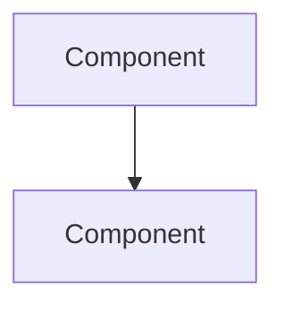

# The War Room — Blog Operations Playbook
**Brand:** The War Room — by Jamal Moutaib (resolved 2026-06-24; was "Network Authority")
**Owner: JAMO only. FAMO has no access to this domain — Foundever-only, separate hierarchy.**

## 0. Facts (do not re-derive, do not ask the user to re-confirm)

| | |
|---|---|
| Local path | `~/Documents/JMO-OS/projects/content/jamalmoutaib` |
| Remote | `https://github.com/jamalmoutaib/jamalmoutaib.github.io` |
| Live URL | `https://jamalmoutaib.github.io/` |
| Stack | Hugo (static) + PaperMod theme (git submodule) + GitHub Actions → GitHub Pages |
| Deploy trigger | any push to `main` |
| Content location | flat — `content/posts/` (not split into pillar folders) |
| Pillar browsing | via `categories` front-matter field, not folders — Hugo auto-generates `/categories/<name>/` |
| Hugo version in CI | 0.163.3 (pinned in `.github/workflows/hugo.yml`) |

## 1. Hard rules — no exceptions

1. **Never edit `/public` directly.** It's regenerated by Actions on every push; anything written there by hand is gone on the next deploy.
2. **Never write the body content of an *incident* post.** `new post` and the first-person pipeline generate structure only. The narrative, CLI output, and voice are Jamal's input — JAMO stops after scaffolding and waits. **One scoped exception:** the `draft explainer [topic]` command in §6 may write a full body, because it is built entirely from cited public sources and never claims to be Jamal's lived experience. That exception does not extend to incident posts.
3. **Never report a publish as successful on `git push` alone.** Confirmed-but-not-persisted is exactly the failure mode already fixed in FAMO for FOUNDEVER-OS; the same discipline applies here. Success = all four phases in §3 pass, including the live HTTP check.
4. **The site title is "The War Room — by Jamal Moutaib."** Resolved 2026-06-24 (was "Network Authority" — open flag now closed). Update hugo.toml `title` and `homeInfoParams.Title` if not already done.

   *(Resolved 2026-06-24: site is now "The War Room" — by Jamal Moutaib. This rule stays here as a record of the discipline, not because the decision is still open.)*

5. **Categories serve two axes — populate both, every technical post.** `categories` is being used for both content-type (`incident`, `career`, `architecture-decision`) and topic-pillar (`automation`, `cloud-networking`, `security`, `architecture`) — Hugo supports multiple categories per post, use both. The homepage's Featured Categories cards link to topic-pillar category pages specifically; a post tagged only `["incident"]` with no topic-pillar category is invisible to those cards even when it's squarely about that topic. Before publishing any technical post, confirm `categories` includes at least one of: `automation`, `cloud-networking`, `security`, `architecture` — in addition to, not instead of, any content-type category. Career/leadership posts are exempt; they aren't meant to map to a technical pillar.

## 2. One-time setup (run once; skip any step already done)

```bash
cd ~/Documents/JMO-OS/projects/content
git clone --recurse-submodules https://github.com/jamalmoutaib/jamalmoutaib.github.io.git jamalmoutaib
cd jamalmoutaib
git rm -r --cached public .hugo_build.lock
```

Write the following files exactly as given:

**`.gitignore`**
```
/public/
/resources/_gen/
.hugo_build.lock
```

**`hugo.toml`** (full file — replaces existing)
```toml
baseURL = "https://jamalmoutaib.github.io/"
languageCode = "en"
title = "Network Authority"
theme = "PaperMod"

[params]
defaultTheme = "dark"
ShowReadingTime = true
ShowShareButtons = true
ShowPostNavLinks = true
ShowCodeCopyButtons = true

[menu]

[[menu.main]]
name = "Posts"
url = "/posts/"
weight = 1

[[menu.main]]
name = "Categories"
url = "/categories/"
weight = 2

[[menu.main]]
name = "Resources"
url = "/resources/"
weight = 3

[[menu.main]]
name = "About"
url = "/about/"
weight = 4
```

**`archetypes/incident.md`**
```markdown
---
title: "{{ replace .File.ContentBaseName "-" " " | title }}"
date: {{ .Date }}
draft: true
tags: []
categories: [""]
summary: ""
---

## State

What was actually broken — the symptom exactly as it presented, one paragraph.

## Impact

What was affected, and what was at stake.

## Environment

- Vendor / platform / version:
- Topology / path:
- Protocol(s) involved:

## Diagnostic path

The evidence — CLI output, captures, logs — including the dead ends you ruled out.

```text
# diagnostic output here
```

## Root cause

## Action / Fix

```text
# config or script
```

## Verification

```text
# proof this is actually fixed
```

## Lessons learned

-
```

**`archetypes/architecture.md`**
```markdown
---
title: "{{ replace .File.ContentBaseName "-" " " | title }}"
date: {{ .Date }}
draft: true
tags: []
categories: [""]
summary: ""
---

## Requirements

What this design has to satisfy.

## Options considered

| Option | Pros | Cons |
|---|---|---|
| | | |

## Design



## Trade-offs

## Final decision

## Lessons learned

-
```

**`content/about.md`**
```markdown
---
title: "About"
layout: "single"
url: "/about/"
summary: about
---

I help network teams design, automate, and operate enterprise infrastructure at scale.

Here you'll find deep technical content covering BGP, SD-WAN, cloud networking, security, automation, observability, incident management, and network leadership — written from real operations, not vendor marketing.

I'm a Senior Network Engineer and Network Team Lead with hands-on experience designing, operating, and troubleshooting enterprise networks across routing and switching, security, SD-WAN, cloud connectivity, and automation. Currently pursuing CCNP Enterprise.

**Every article here is rooted in a real incident.** Identifying details — company names, IP addresses, hostnames, ticket numbers — are anonymized. The technical substance is not.

**Connect:**
- [LinkedIn](https://linkedin.com/in/jamalmoutaib)
- [GitHub](https://github.com/jamalmoutaib)
```

**`content/resources.md`**
```markdown
---
title: "Resources"
layout: "single"
url: "/resources/"
summary: resources
---

## Free Resources

### The NetOps Python Script Library
Production-tested scripts for multi-vendor config backup, BGP/OSPF health checks, and firewall config auditing.

*[Get the script library →](#)*

---

## Work With Me

**Emergency Network War Room** (60 min) — Live troubleshooting support for active P1 incidents.

**Architecture Review** (30 min) — Design sanity-check before you commit engineering hours.

*[Book a session →](#)*
```

**`layouts/_default/_markup/render-codeblock-mermaid.html`**
```html
<pre class="mermaid">
{{ .Inner }}
</pre>
{{ .Page.Store.Set "hasMermaid" true }}
```

**`layouts/partials/extend_footer.html`**
```html
{{ if .Page.Store.Get "hasMermaid" }}
<script type="module">
  import mermaid from 'https://cdn.jsdelivr.net/npm/mermaid@10/dist/mermaid.esm.min.mjs';
  mermaid.initialize({ startOnLoad: true, theme: document.body.dataset.theme === 'dark' ? 'dark' : 'default' });
</script>
{{ end }}
```

Patch the existing first post — add a category so the taxonomy isn't empty on first build:

**`content/posts/my-first-post.md`**
```markdown
---
title: "My First Network Engineering Post"
date: 2026-06-23
draft: false
categories: ["automation"]
tags: ["intro"]
---
Hello world — this is my new technical blog.
```

Then:

```bash
hugo --buildDrafts
```
**Gate: zero lines containing `ERROR` in the output. If any error appears, stop and report it verbatim — do not attempt a silent fix.**

```bash
git add .
git commit -m "Add gitignore, Mermaid support, categories nav, archetypes, about/resources pages"
git push
```

Then run the deploy-verify sequence in §3, Phase 4, before reporting this step done.

## 3. Standing command: `publish post [slug]`

**Phase 1 — Pre-flight**
Read `content/posts/[slug].md`. Confirm: `draft: false`, `tags` non-empty, `categories` non-empty, `summary` non-empty. Any field missing → report exactly which field(s) and stop. Do not fix the content yourself.

**Phase 2 — Build verify**
```bash
hugo --buildDrafts
```
Confirm zero `ERROR` lines. Any error → report verbatim and stop.

**Phase 3 — Ship**
```bash
git add .
git commit -m "Add: [title]"
git push
```

**Phase 4 — Deploy verify (mandatory — this is the gate, not a formality)**
```bash
gh run list --limit 1 --json status,conclusion
```
Poll until `status` is `completed`. If `conclusion` is not `success` → report the failure and stop. Do not say "published."

```bash
curl -sI https://jamalmoutaib.github.io/posts/[slug]/
```
Confirm `HTTP 200`. Then fetch the page body and confirm the post's `title` string actually appears in it — not just that the page returned 200.

Only after all four phases pass: report "Published and verified live at https://jamalmoutaib.github.io/posts/[slug]/".

## 4. Standing command: `new post [incident|architecture] [slug]`

```bash
hugo new content/posts/[slug].md --kind [incident|architecture]
```
Report the file path. Stop. Do not write body content.

## 5. Standing command: `audit blog`

Walk `content/posts/`. Report only — take no corrective action without explicit instruction:
- Any `draft: true` post older than 14 days
- Any post missing `summary`, `tags`, or `categories`
- Post count per category
- Any technical post (not career/leadership) whose `categories` includes no topic-pillar value (`automation`, `cloud-networking`, `security`, `architecture`) — flag by title and current category, per Hard Rule 5
- Whether any homepage Featured Categories card text is now stale: cross-check `public/categories/` against the four card lines in `hugo.toml`'s `homeInfoParams.Content` — a card reading "coming soon" for a pillar that now has content, or a card linking to a pillar that's actually still empty, is a defect either direction

## 6. Standing command: `draft explainer [topic]`

A second drafting mode, distinct from the first-person incident pipeline. Use it when the goal is a sourced technical walkthrough of a known problem rather than a war story Jamal personally lived. JAMO writes the full body in this mode and does **not** ask Jamal for lived-experience input — that's the whole point of the command.

**The one hard rule of this mode: trusted sources only.**
- Facts, values, CLI/config, log output, and protocol behavior must each trace to an authoritative source: an RFC/IETF document, official vendor documentation (Cisco, Arista, Juniper, Palo Alto, etc.), or official OS networking docs.
- Community/forum/personal-blog material (Cisco Community, ipSpace.net, Stack Exchange, etc.) may be used **only** when clearly labeled in-text as a field report / account, never stated as protocol fact. Quote it as "a documented field report from <source>," with attribution.
- Anything that can't be sourced does not go in. No invented values, no plausible-sounding output, no composite "typical" numbers presented as real.

**Workflow:**
1. Research from authoritative sources (same source-quality bar as the blog-article-pipeline Stage 1). Search the web; do not rely on training memory for values, commands, or log formats.
2. Pick one or more *documented public cases* with concrete values and real output. Prefer a vendor's own reproduced case (e.g. a Cisco TAC document) as the spine; a named engineer's published field account makes a strong contrast/edge-case section.
3. Write the full body around those cases. Defaults that protect the blog's credibility (keep unless Jamal says otherwise):
   - **Third-person framing** — never "I diagnosed this." Use "Cisco's documented recreation shows…", "a field report from <source> describes…".
   - **A one-line sourcing note at the top** stating the post is built from documented public cases, not a first-person incident.
   - **Inline citations** for quoted output/values, and a Sources line at the foot linking each source.
4. Front matter: `draft: true` (publishing still goes through §3 `publish post`). Categories follow Hard Rule 5 (both axes). Suggested content-type value for this mode: `explainer` — keeps these visibly distinct from `incident` posts. (If `explainer` should become a real homepage pillar, that's a deliberate hugo.toml card change to raise first, per the dual-axis rule.)
5. Produce the file at `content/posts/[slug].md` and stop. Do not flip `draft: false`.

This mode does not replace `new post` / the incident pipeline; it sits alongside it. When in doubt about which Jamal wants, ask once — but within `draft explainer`, do not gate on lived-experience input.
