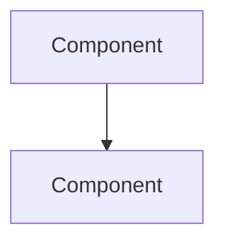

## Requirements

What this design has to satisfy.

## Options considered

| Option | Pros | Cons |
|---|---|---|
| | | |

## Design

```mermaid
graph TD
    A[Component] --> B[Component]
```

## Trade-offs

## Final decision

## Lessons learned

-
