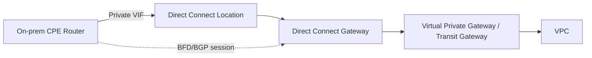

Intermittent BGP flapping over a Direct Connect link is one of those problems that looks like "the cloud is unreliable" until you actually work the checklist — at which point it's almost always one of six specific, checkable things. This is the order I actually run through, cheapest and fastest checks first, before anyone opens a case with AWS Support.

## Topology



The BGP session runs CPE-to-AWS across that whole path, but most flapping causes live in the first two hops — the physical cross-connect and the CPE-side BGP/BFD config — not in AWS's infrastructure.

## The checklist, in diagnostic order

### 1. Physical layer at the Direct Connect location

Cheapest check, do it first.

```text
show interface TenGigabitEthernet0/0/1 | include CRC|error|drop
```

CRC errors or input errors climbing over time point at the cross-connect, the optic, or the patch panel at the colo — not at BGP at all. A flapping session with clean physical counters rules this out in thirty seconds; don't skip it just because it feels too basic.

### 2. BFD timer mismatch

If BFD is enabled on the session, asymmetric intervals between CPE and AWS will cause one side to declare the neighbor down before the other side agrees, which presents as flapping rather than a clean down event.

```text
show bfd neighbors details
```

Confirm the negotiated interval and multiplier match what you intended on both ends. If you didn't explicitly configure BFD intervals on the CPE side, you're running platform defaults — confirm what those actually are on your specific platform rather than assuming.

### 3. BGP keepalive/hold timer mismatch

```text
show bgp neighbors | include Hold|Keepalive
```

Less common as a root cause than BFD mismatches, but worth a thirty-second look — especially if BFD isn't in use on this session and the flap interval roughly matches a hold-timer expiry.

### 4. MTU / jumbo frame mismatch

Direct Connect private VIFs support 9001-byte jumbo frames, but only end to end if every hop in the path — CPE interface, any intermediate switch, and the AWS-side configuration — agrees. A mismatch here doesn't always show as a clean BGP down; it can show as a session that establishes, then drops under load (often when a routing update larger than the smallest MTU in the path needs to be sent).

```text
show interface TenGigabitEthernet0/0/1 | include MTU
```

Compare against the VIF's configured MTU in the AWS console. If they don't match, you've found it.

### 5. Redundant VIF asymmetry

If this is a redundant (active/active or active/standby) Direct Connect setup, check whether AS-path prepending or local-preference is configured consistently across both paths. Asymmetric configuration can cause traffic to fail over and back repeatedly under marginal conditions — which looks exactly like flapping at the BGP layer, but the actual cause is a routing-policy oscillation, not a session-stability problem.

### 6. AWS-side maintenance and health events

Last, not first — but don't skip it. Direct Connect connections do go through scheduled and unscheduled maintenance.

```bash
aws directconnect describe-connections --connection-id dxcon-xxxxxxxx
aws directconnect describe-virtual-interfaces --connection-id dxcon-xxxxxxxx
```

Cross-reference against the AWS Health Dashboard for your account and region. A flap that correlates exactly with a maintenance window isn't a misconfiguration — it's expected behavior on a non-redundant connection, and the fix is architectural (add a second connection in a different location), not a config change.

## Catching it when it's actually intermittent

The hard part of "intermittent" flapping is that by the time you've opened a session to investigate, it's stable again. Don't rely on a one-time manual check — poll continuously and let the evidence accumulate:

```python
# Excerpt from bgp_health_check.py — full script in the NetOps Script Library
SHOW_BGP_COMMANDS = {
    "cisco_ios": "show ip bgp summary",
    "cisco_xe": "show ip bgp summary",
}

def check_device(device: dict) -> list[dict]:
    # connects via Netmiko, parses neighbor state, returns anything not Established
    ...
```

Run it on a 1-2 minute cron interval during the investigation window. When the session flaps, you'll have a timestamped record to correlate against the AWS Health Dashboard and your own physical-layer counters — instead of trying to reconstruct what happened from memory after the fact.

## Verification

Once you've identified and corrected the actual cause:

```text
show bgp neighbors | include Up/Down|State
```

Confirm `Up/Down` time is climbing continuously across at least one full suspected-trigger cycle (e.g., past a scheduled maintenance window, or past the load condition that was triggering MTU-related drops) before calling it resolved. A session that's been up for ten minutes after a fix isn't yet evidence the fix worked.

## Key takeaways

- Check physical layer counters before anything BGP-specific — it's the fastest check and rules out an entire category of cause.
- BFD timer mismatches present as flapping, not as a clean down — don't assume BFD is configured symmetrically just because it's enabled on both ends.
- Jumbo frame mismatches can look like a stability problem under load rather than an obvious MTU error.
- For genuinely intermittent issues, continuous polling beats point-in-time manual checks — you need a timestamped record to correlate against, not a memory of when it happened.

---

*Want the BGP health-check script (and two others) ready to run against your own inventory? [Grab the NetOps Script Library](/resources/) — free. Dealing with this exact problem right now and need a second pair of eyes? [Book a War Room session](/resources/#work-with-me).*
