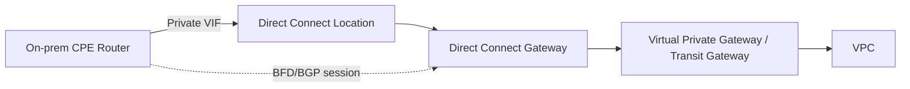

Intermittent BGP flapping over Direct Connect is one of those problems that looks like "the cloud is unreliable" — until you work the checklist. At that point it's almost always one of six specific, checkable things. This is the order I run through them: cheapest and fastest first, before anyone opens a case with AWS Support.

## Topology



The BGP session runs CPE-to-AWS across that whole path, but most flapping causes live in the first two hops — the physical cross-connect and the CPE-side config. Not in AWS's infrastructure.

## The checklist, in diagnostic order

### 1. Physical layer at the Direct Connect location

Do this first. Thirty seconds, and it rules out an entire category.

```text
show interface TenGigabitEthernet0/0/1 | include CRC|error|drop
```

CRC errors or input errors climbing over time point at the cross-connect, the optic, or the patch panel at the colo — not BGP. Clean physical counters don't tell you where the problem is, but they tell you where it isn't. Don't skip this because it feels too basic.

### 2. BFD timer mismatch

If BFD is enabled, asymmetric intervals cause one side to declare the neighbor dead before the other side agrees — which presents as flapping rather than a clean down event.

```text
show bfd neighbors details
```

Confirm the negotiated interval and multiplier match what you intended on both ends. If you didn't explicitly configure BFD intervals on the CPE side, you're running platform defaults. Confirm what those actually are on your hardware — don't assume.

### 3. BGP keepalive/hold timer mismatch

```text
show bgp neighbors | include Hold|Keepalive
```

Less common than BFD mismatches, but worth thirty seconds — especially if BFD isn't in use and the flap interval roughly matches a hold-timer expiry.

### 4. MTU / jumbo frame mismatch

Direct Connect private VIFs support 9001-byte jumbo frames, but only if every hop in the path agrees — CPE interface, any intermediate switch, and the AWS-side VIF. A mismatch here doesn't always show as a clean BGP down. More often it shows as a session that establishes cleanly, then drops under load, when a routing update larger than the smallest MTU in the path needs to get through.

```text
show interface TenGigabitEthernet0/0/1 | include MTU
```

Compare against the VIF's configured MTU in the AWS console. If they don't match, you've found it.

### 5. Redundant VIF asymmetry

On a redundant (active/active or active/standby) setup, check whether AS-path prepending or local-preference is configured consistently across both paths. Asymmetric routing policy under marginal conditions can cause traffic to fail over and back repeatedly — which looks exactly like BGP flapping at the session layer, but the actual cause is a routing-policy oscillation.

### 6. AWS-side maintenance and health events

Last, not first — but don't skip it. Direct Connect connections go through scheduled and unscheduled maintenance.

```bash
aws directconnect describe-connections --connection-id dxcon-xxxxxxxx
aws directconnect describe-virtual-interfaces --connection-id dxcon-xxxxxxxx
```

Cross-reference against the AWS Health Dashboard for your account and region. A flap that correlates exactly with a maintenance window isn't a misconfiguration — it's expected behavior on a non-redundant connection. The fix there is architectural: a second connection in a different location, not a config change.

## Catching it when it's actually intermittent

The hard part of "intermittent" is that by the time you've opened a session to investigate, it's stable again. Don't rely on a one-time manual check — poll continuously and let the evidence accumulate.

```python
# Excerpt from bgp_health_check.py — full script in the NetOps Script Library
SHOW_BGP_COMMANDS = {
    "cisco_ios": "show ip bgp summary",
    "cisco_xe": "show ip bgp summary",
}

def check_device(device: dict) -> list[dict]:
    # connects via Netmiko, parses neighbor state, returns anything not Established
    ...
```

Run it on a 1–2 minute cron interval during the investigation window. When the session flaps, you'll have a timestamped record to correlate against the Health Dashboard and your physical-layer counters — instead of reconstructing a timeline from memory after the fact.

## Verification

Once you've identified and corrected the cause:

```text
show bgp neighbors | include Up/Down|State
```

Watch `Up/Down` time climb continuously across at least one full suspected-trigger cycle — past a maintenance window, or past the load condition that was causing MTU drops — before calling it resolved. Ten minutes of uptime after a fix isn't evidence the fix worked.

## Key takeaways

- Physical layer first. It's the fastest check and eliminates an entire category of cause.
- BFD mismatches present as flapping, not a clean down. Don't assume symmetry just because BFD is enabled on both ends.
- MTU mismatches under jumbo-frame configs appear as session instability under load, not a textbook MTU error.
- For genuinely intermittent issues, continuous polling gives you a timestamped record to work from. A one-time manual check gives you nothing if the session's stable when you look.

---

*Want the BGP health-check script (and two others) ready to run against your own inventory? [Grab the NetOps Script Library](/resources/) — free. Dealing with this right now and need a second pair of eyes? [Book a War Room session](/resources/#work-with-me).*
